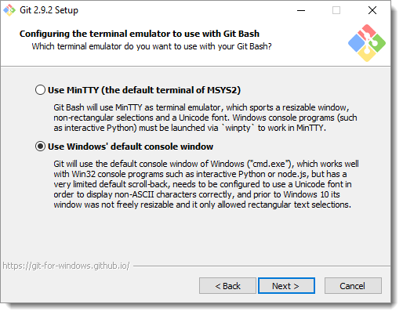

# Git Bash

This is for Git Bash for windows (at the moment being)

## Install

You can download and install from [here](https://git-scm.com/downloads). 

Its important to know under the install a way you can migrate the MinTTy / winpty problem before it happens, see under 'fix to the problem MinTTY / winpty'.

## Troubleshooting

Git Bash can cause some problems with eg. Docker and windows paths.

Common problems:
    - Paths
    - MinTTY / winpty

### fix to the problem MinTTY / winpty

You need to reinstall git bash, and instead of choosing 'Use MinTTY', you should choose 'Use Windows default console window' as shown in image below.

[source](https://willi.am/blog/2016/08/08/docker-for-windows-interactive-sessions-in-mintty-git-bash/)